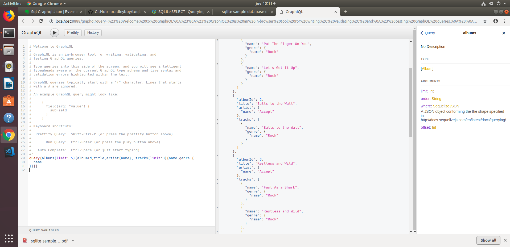

# SQLite GraphQL conector 

Antes de empezar...
```shell
    xxx:~$ sudo apt-get install sqlite3
    xxx:~$ npm install -g tuql
    xxx:~$ mkdir sqlite_graphql
    xxx:~$ cd sqlite_graphql
    xxx:~$ wget http://www.sqlitetutorial.net/wp-content/uploads/2018/03/chinook.zip
    xxx:~$ unzip chinook.zip
    xxx:~$ rm chinook.zip
    xxx:~$ tuql --db ./chinook.db --port 8888 --graphiql
```

Abrimos un navegador en la url:  http://localhost:8888/graphql

y podemos explorar / consultar la base de datos ... 


por ejemplo:

    query{
        albums(limit: 5){albumId,title,artist{name}, tracks(limit:3){name,genre {name} }}
    }

o 

    query{
      customers(limit: 10) {
        lastName
        firstName
        invoices {
          billingAddress
          billingCity
          billingState
          billingCountry
          billingPostalCode
          invoiceItems {
            track {
              name
              mediaType {
                name
              }
              genre {
                name
              }
            }
          }
        }
      }
    }

Añadir un artista:

    mutation{
        createArtist (name: "New Artist") {name}
    }


Modificar el nombre de un artista:

    mutation{
        updateArtist (artistId: 276, name: "Edited New Artist") {name}
    }


Eliminar un artista:
    
    mutation{
        deleteArtist (artistId: 276) {
        success
        }
    }

